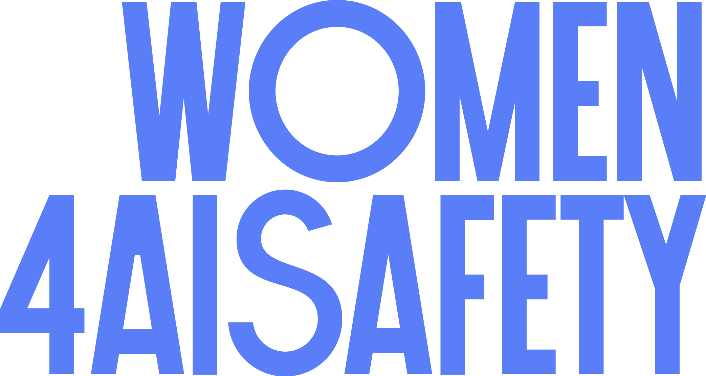

# Contributing

Guía breve de convenciones del sitio, para mantener consistencia entre páginas.

## Páginas en modo oscuro (`*-dark.html`)

Toda página con sufijo `-dark.html` debe llevar en su `<head>`, justo debajo del `<title>`, una etiqueta `<link rel="canonical">` apuntando a la URL absoluta (con `www`, `https://www.women4aisafety.com/...`) de su versión clara equivalente:

```html
<title>Título de la página (dark)</title>
<link rel="canonical" href="https://www.women4aisafety.com/pagina.html">
```

Ejemplos actuales:

| Página dark | Canonical |
|---|---|
| `home-dark.html` | `https://www.women4aisafety.com/` |
| `seminar-dark.html` | `https://www.women4aisafety.com/seminar.html` |
| `session-johanna-angulo-dark.html` | `https://www.women4aisafety.com/session-johanna-angulo.html` |

Esto evita contenido duplicado en el índice de Google: Search Console consolida la página dark bajo la clara en lugar de tratarlas como dos URLs distintas compitiendo por el mismo contenido.

Por el mismo motivo, ninguna página dark lleva metadatos SEO propios (`meta description`, `og:*`, `twitter:*`, JSON-LD). No es contenido indexable independiente — es solo el toggle 🌙 de la página clara, así que hereda semánticamente los metadatos de esta última.

## Logo del nav y del footer

En toda página, tanto el logo del `<nav>` como el del `<footer>` deben ir envueltos en `<a href="index.html">`. No debe quedar ningún `` de logo suelto sin enlazar a inicio.

```html
<a href="index.html" style="display:flex;margin-right:auto"></a>
```

Antes de cualquier commit que añada o modifique una página de sesión, ejecuta `scripts/check-logo-links.sh` desde la raíz del repo. Falla con mensaje claro (archivo y línea) si algún logo no enlaza a `index.html`:

```
./scripts/check-logo-links.sh
```

## Páginas de sesión (`session-*.html`)

Toda página de sesión nueva se crea **copiando `session-template.html`** y rellenando sus marcadores de posición. Nunca copiando otra página de sesión ya existente (como `session-johanna-angulo.html`) ni escribiéndola desde cero — así se evita arrastrar contenido de la ponente anterior por error y se garantiza que el nav, el footer y el enlace del logo ya vienen corregidos.

Marcadores de `session-template.html`:

| Marcador | Qué va ahí |
|---|---|
| `[TITULO_SESION]` | Título de la charla (title, h1, og:title...) |
| `[SLUG_SESION]` | Slug del nombre de archivo, ej. `jane-doe` → `session-jane-doe.html` |
| `[CATEGORIA_SESION]` | Etiqueta de categoría (Technical research, Governance & policy, Career...) |
| `[DESCRIPCION_SESION]` | Subtítulo / resumen de una frase de la charla |
| `[NOMBRE_PONENTE]` | Nombre de la ponente |
| `[BIO_PONENTE]` | Biografía |
| `[FOTO_PONENTE]` | Nombre de archivo de la foto local (ver convención de imágenes más abajo) |
| `[LINK_REDES_PONENTE]` | URL de LinkedIn (u otra red) de la ponente |
| `[EMBED_YOUTUBE]` | URL de embed de YouTube (`https://www.youtube.com/embed/ID`); si aún no hay grabación, borra el bloque del iframe entero (está marcado con un comentario) |
| `[EMBED_SLIDES]` | URL de las slides; si no hay, borra el bloque del enlace entero (está marcado con un comentario) |
| `[FECHA_SESION]` | Fecha de la sesión, o "Date TBA" |

Después de rellenar los marcadores y guardar como `session-[slug].html`, ejecuta `scripts/check-logo-links.sh` antes de commitear.

## Dominio canónico

Todas las URLs absolutas del sitio (canonical tags, `sitemap.xml`, la línea `Sitemap:` de `robots.txt`, JSON-LD) usan el dominio con `www`: `https://www.women4aisafety.com/`. No mezclar con la variante sin `www`.

## `sitemap.xml`

Solo incluye páginas canónicas e indexables (las que tienen su propio `<link rel="canonical">` y metadatos SEO): `index.html`, `about.html`, `seminar.html`, `session-johanna-angulo.html` y cualquier página de sesión futura equivalente. Las páginas `*-dark.html` quedan fuera por la razón explicada arriba.

## Datos estructurados (JSON-LD)

`index.html` incluye `Organization` y `EventSeries`. Para el seminario recurrente se usa `EventSeries` en vez de `Event`: `Event` exige una `startDate` concreta, y las próximas fechas de sesión suelen estar como "Date TBA" en `seminar.html`. `EventSeries` no requiere fecha fija, así que evita inventar datos falsos en el schema.

## Commits

Los commits de este repo usan el email noreply de GitHub para el autor, en vez de un email personal o el autogenerado por el sistema:

```
163174714+hitchhikergalactic@users.noreply.github.com
```

Configurado con `git config --global user.email`. Evita el rechazo de GitHub (`GH007: push would publish a private email address`) sin depender de verificar un email personal en la cuenta.
